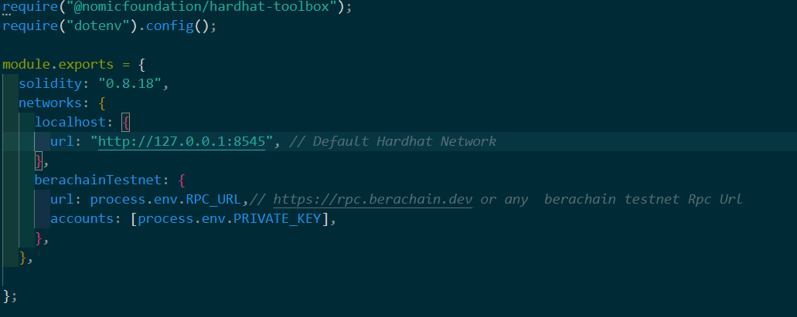

# ERC-4626 Auto-Compounding Vault
-An ERC-4626 vault contract that complies with the ERC-4626 standard.
-The vault should accept LP tokens from Kodiak DEX as deposits.
-Tokens deposited in the vault should be automatically deployed to the Beradrome farm to earn oBERO rewards.
-oBERO rewards will be swapped with Honey and Nectar on Kodiak DEX.
-The swapped ,Honey and Nectar tokens will be deposited to Kodiak Island for Honey-Nectar  tokens to recieve Islan LP tokens for the Vault 
-Those Island LP tokens will be recieved by vault and will be deposited to the berodrome farm

# Deployment Guide for the contract on Berachain Testnet

-> install the project's repository and setup the project by installing all the dependencies 
->add RPC provider URL for berachain testnet and your private key as mentioned below-

  module.exports = {
  solidity: "0.8.18",
  networks: {
    localhost: {
      url: "http://127.0.0.1:8545", // Default Hardhat Network  
    },
    berachainTestnet: {
      url: process.env.RPC_URL,// https://rpc.berachain.dev or any  berachain testnet Rpc Url 
      accounts: [process.env.PRIVATE_KEY],
    },
  },

};

->Run the following command in the terminal  to compile the contracts
   npx hardhat compile 
-> Deploy the contract on berachain testnet by running following command in terminal-
   
   npx hardhat run scripts/deploy.js --network berachainTestnet

